# MOT20 pedestrian tracking benchmark

A reproducible comparison of **YOLO26s** and **YOLO26m** for pedestrian detection and multi-object tracking on the four sequences of the **MOT20 training split**. The evaluated trackers are **ByteTrack**, **BoT-SORT**, **OC-SORT**, **Deep-OC-SORT**, and **BoostTrack**.

Inspired by the clear experiment-and-results layout of [Person-ReID-BenchMark](https://github.com/BASSAT-BASSAT/Person-ReID-BenchMark).

## Contents

- [Setup](#setup)
- [Detector selection](#detector-selection)
- [MOT20 detection benchmark](#mot20-detection-benchmark)
- [Results](#results)
- [Performance comparisons](#performance-comparisons)
- [Detailed tables and graphs](docs/benchmark/tables.md)
- [Interpretation](#interpretation)
- [Repository layout](#repository-layout)
- [Reproduce the experiments](#reproduce-the-experiments)
- [Scope and limitations](#scope-and-limitations)

## Setup

| Item | Recorded setup |
| --- | --- |
| Dataset | MOT20 **train**: MOT20-01, MOT20-02, MOT20-03, MOT20-05; **8,931 frames** total |
| Detectors | Pretrained `yolo26s.pt` and `yolo26m.pt`; person class only |
| Input / inference | 1280 px; confidence 0.10; NMS IoU 0.70; FP32 |
| Hardware | NVIDIA Tesla T4 GPU (Kaggle notebooks) |
| Evaluation | TrackEval for tracking; Ultralytics validation for ByteTrack notebook detector metrics |
| Software | Ultralytics 8.4.171 and PyTorch 2.10.0+cu128 recorded for OC-SORT, Deep-OC-SORT, and BoostTrack; BoxMOT 25.0.0 recorded for BoostTrack |

Tracker settings and any run-specific differences are recorded in the [configuration files](results/). ByteTrack uses Ultralytics `bytetrack.yaml`; OC-SORT and Deep-OC-SORT use the supplied YAML files. BoostTrack uses an OSNet ReID model and the installed implementation defaults recorded in its configuration. BoT-SORT scores and timing come from its own run summaries; its environment details were not recorded in the supplied artifacts. These runs were performed separately, so timing comparisons should be treated as indicative rather than a controlled simultaneous benchmark.


## Detection benchmarks

### CrowdHuman detection benchmark

YOLO26s and YOLO26m were chosen after a separate detector comparison on **CrowdHuman**, a dense-crowd pedestrian dataset. Eighteen detectors were evaluated: the YOLOv8, YOLO11, YOLO12, and YOLO26 families in n, s, m, and l sizes where available, plus RT-DETR-l and RT-DETR-x. All 18 runs completed successfully. Full results are in [crowdhuman_detector_comparison.csv](results/crowdhuman_detector_comparison.csv).

**Detector accuracy ranking (mAP@50:95 on CrowdHuman)**

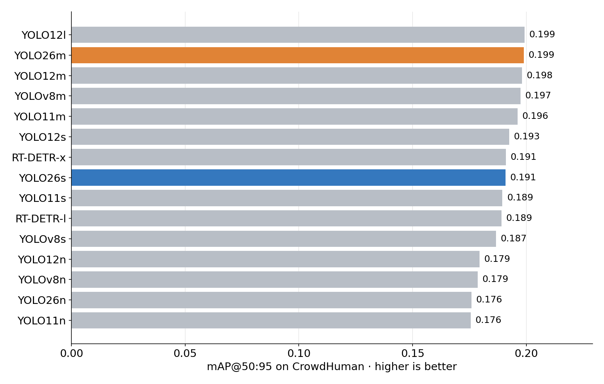

**Detector accuracy versus speed (mAP@50:95 against GPU FPS)**

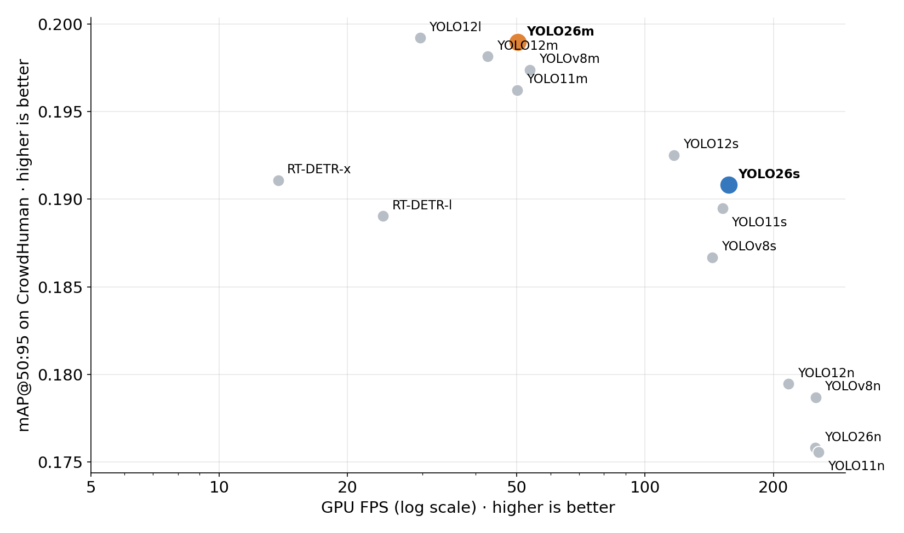

| Detector | Params (M) | Precision ↑ | Recall ↑ | mAP@50 ↑ | mAP@50:95 ↑ | GPU inference (ms) ↓ | GPU FPS ↑ | Peak GPU (GB) ↓ |
| --- | ---: | ---: | ---: | ---: | ---: | ---: | ---: | ---: |
| **YOLO26l** | 26.30 | 0.7734 | 0.6308 | 0.7208 | **0.4596** | 16.04 | 62.35 | 0.50 |
| YOLOv8l | 43.69 | 0.7705 | 0.6284 | 0.7121 | 0.4537 | 17.88 | 55.94 | 0.70 |
| YOLO11l | 25.37 | **0.7794** | 0.6144 | 0.7118 | 0.4512 | 16.71 | 59.85 | **0.42** |
| YOLO12l | 26.45 | 0.7849 | 0.6085 | 0.7105 | 0.4507 | 24.69 | 40.50 | 0.54 |
| **YOLO26m** | 21.90 | 0.7664 | 0.6184 | 0.7068 | **0.4476** | 11.12 | **89.89** | **0.39** |
| YOLOv8m | 25.90 | 0.7609 | 0.6233 | 0.7057 | 0.4393 | 11.89 | 84.13 | 0.49 |
| YOLO12m | 20.20 | 0.7786 | 0.5989 | 0.6981 | 0.4391 | 14.76 | 67.76 | 0.39 |
| YOLO11m | 20.11 | 0.7696 | 0.6035 | 0.6951 | 0.4374 | 11.20 | 89.25 | 0.79 |
| RT-DETR-x | 67.47 | 0.7214 | 0.6044 | 0.6770 | 0.4227 | 46.90 | 21.32 | 0.64 |
| RT-DETR-l | 32.97 | 0.7236 | 0.6025 | 0.6684 | 0.4142 | 41.37 | 24.17 | 0.65 |
| **YOLO26s** | 10.01 | 0.7543 | 0.5740 | 0.6644 | **0.4075** | 10.37 | 96.47 | 0.59 |
| YOLO12s | 9.29 | 0.7619 | 0.5642 | 0.6623 | 0.4044 | 14.05 | 71.16 | 0.47 |
| YOLOv8s | 11.17 | 0.7545 | 0.5857 | 0.6688 | 0.4017 | **6.64** | **150.52** | **0.33** |
| YOLO11s | 9.46 | 0.7451 | 0.5762 | 0.6614 | 0.3994 | 9.00 | 111.08 | 0.66 |
| YOLOv8n | 3.16 | 0.7404 | 0.5295 | 0.6182 | 0.3559 | 6.61 | 151.38 | 0.27 |
| YOLO12n | 2.60 | 0.7429 | 0.5154 | 0.6082 | 0.3528 | 14.07 | 71.06 | 0.41 |
| YOLO11n | 2.62 | 0.7330 | 0.5186 | 0.6061 | 0.3474 | 8.68 | 115.23 | 0.60 |
| YOLO26n | 2.57 | 0.7389 | 0.5085 | 0.6021 | 0.3456 | 10.21 | 97.98 | 0.52 |

Why these two:

- **YOLO26m** provides the strongest accuracy-speed balance among the selected operating points: mAP@50:95 of **0.4476**, 89.89 FPS, 11.12 ms GPU inference, and 0.39 GB peak GPU memory. It is only 0.0120 below the best overall mAP@50:95 (YOLO26l at 0.4596), while being substantially faster (89.89 versus 62.35 FPS).
- **YOLO26s** provides a smaller operating point with mAP@50:95 of **0.4075**, 96.47 FPS, and 10.37 ms GPU inference. It has higher mAP@50:95 than the other small YOLO26/YOLO11/YOLOv8/YOLO12 models in this comparison, although YOLOv8s is substantially faster at 150.52 FPS.
- **The pair covers two operating points** within one model family, so the effect of detector size on tracking can be measured without changing architecture.
- **Not the best on every metric:** YOLO26l has the highest mAP@50:95 (0.4596), while YOLOv8s has the highest FPS among the s-size models (150.52 FPS) and YOLOv8n has the highest FPS overall (151.38 FPS). The selected pair therefore represents an accuracy-speed trade-off rather than the single best score on every metric.
- **RT-DETR remains slower:** RT-DETR-x and RT-DETR-l achieve mAP@50:95 of 0.4227 and 0.4142 respectively, while running at only 21.32 and 24.17 FPS.

These CrowdHuman figures come from a detector-only run with its own settings, so the FPS and memory values are not comparable with the end-to-end tracking FPS and GPU figures in the tables below. The image size, split, and hardware for this run were not recorded in the supplied artifact.

### MOT20 detection benchmark

The detector-selection experiment was followed by a dedicated **MOT20 detection benchmark** using the MOT20 training split. Eighteen pretrained detectors were evaluated for pedestrian detection. The table reports the recorded detection accuracy, GPU inference time, throughput, and peak GPU memory.

**Detector accuracy ranking (mAP@50:95 on MOT20)**
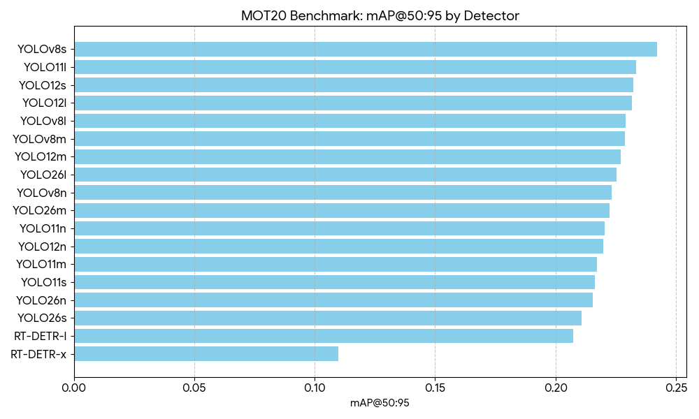

| Detector | Params (M) | Precision ↑ | Recall ↑ | mAP@50 ↑ | mAP@50:95 ↑ | GPU inference (ms) ↓ | GPU FPS ↑ | Peak GPU (GB) ↓ |
| --- | ---: | ---: | ---: | ---: | ---: | ---: | ---: | ---: |
| **YOLOv8s** | 11.16 | 0.7610 | 0.6152 | **0.6040** | **0.2422** | 9.31 | **107.39** | 0.07 |
| YOLO11l | 25.34 | 0.6771 | 0.6497 | 0.5702 | 0.2336 | 30.44 | 32.85 | 0.18 |
| YOLO12s | 9.26 | 0.6464 | **0.6522** | 0.5686 | 0.2324 | 16.87 | 59.28 | 0.12 |
| YOLO12l | 26.40 | 0.6215 | 0.6716 | 0.5730 | 0.2317 | 54.57 | 18.33 | 0.22 |
| YOLOv8l | 43.67 | 0.6432 | 0.6551 | 0.5626 | 0.2292 | 40.52 | 24.68 | 0.19 |
| YOLOv8m | 25.89 | 0.7079 | 0.6450 | 0.5804 | 0.2289 | 26.21 | 38.16 | 0.12 |
| YOLO12m | 20.17 | 0.6470 | 0.6419 | 0.5552 | 0.2270 | 35.67 | 28.03 | 0.20 |
| YOLO26l | 24.81 | 0.6120 | 0.6426 | 0.5485 | 0.2252 | 30.29 | 33.02 | 0.18 |
| YOLOv8n | 3.15 | 0.7356 | 0.5743 | 0.5752 | 0.2232 | **6.03** | 165.96 | **0.03** |
| YOLO26m | 20.41 | 0.6261 | 0.6458 | 0.5495 | 0.2223 | 24.08 | 41.53 | 0.16 |
| YOLO11n | 2.62 | 0.7384 | 0.5543 | 0.5622 | 0.2204 | 8.50 | 117.67 | 0.06 |
| YOLO12n | 2.59 | 0.7453 | 0.5578 | 0.5590 | 0.2197 | 13.48 | 74.18 | 0.07 |
| YOLO11m | 20.09 | **0.7522** | 0.5638 | 0.5485 | 0.2172 | 23.08 | 43.33 | 0.16 |
| YOLO11s | 9.44 | 0.7144 | 0.5973 | 0.5455 | 0.2163 | 10.12 | 98.79 | 0.10 |
| YOLO26n | 2.41 | 0.7408 | 0.5498 | 0.5628 | 0.2156 | 9.94 | 100.61 | 0.06 |
| YOLO26s | 9.50 | 0.6292 | 0.6068 | 0.5213 | 0.2108 | 10.49 | 95.33 | 0.10 |
| RT-DETR-l | 32.15 | 0.6102 | 0.5864 | 0.4791 | 0.2073 | 50.31 | 19.88 | 0.20 |
| RT-DETR-x | 65.63 | 0.4282 | 0.4687 | 0.3105 | 0.1099 | 72.04 | 13.88 | 0.28 |

### MOT20 detector findings

- **Best detection accuracy:** YOLOv8s achieves the highest mAP@50:95 (**0.2422**) and mAP@50 (**0.6040**).
- **Best recall:** YOLO12l records the highest recall (**0.6716**).
- **Best precision:** YOLO11m records the highest precision (**0.7522**).
- **Best speed:** YOLOv8n records the lowest GPU inference time (**6.03 ms**) and highest GPU throughput (**165.96 FPS**).
- **YOLO26 performance:** YOLO26l, YOLO26m, YOLO26n, and YOLO26s achieve mAP@50:95 values of **0.2252**, **0.2223**, **0.2156**, and **0.2108**, respectively.
- **RT-DETR:** RT-DETR-l and RT-DETR-x record mAP@50:95 values of **0.2073** and **0.1099**, with 19.88 and 13.88 FPS respectively.

These are **detector-only MOT20 results**. They are separate from the CrowdHuman detector-selection experiment and from the end-to-end MOT20 tracking results below. The supplied CSV does not specify the full inference configuration, so settings such as image size and confidence threshold should not be inferred from this table alone.


## Results

**HOTA by tracker: YOLO26s vs YOLO26m**

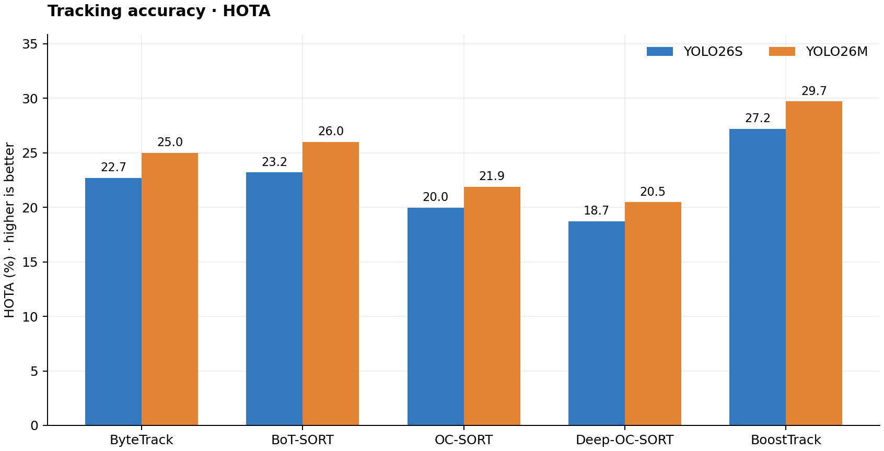

**IDF1 by tracker: YOLO26s vs YOLO26m**

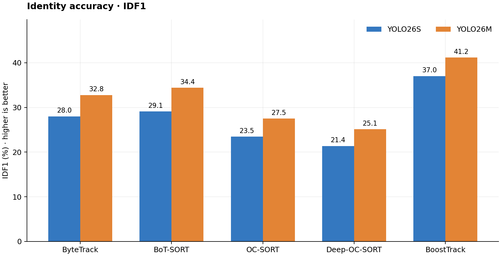

**MOTA by tracker: YOLO26s vs YOLO26m**

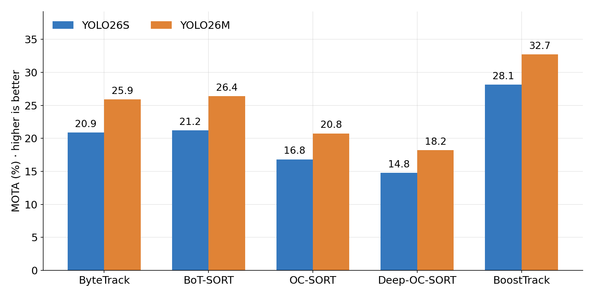

Tracking scores are percentages; higher HOTA, IDF1, MOTA, and FPS are better. Lower ID switches, latency, and GPU allocation are better. Values below are rounded from [comparison.csv](results/comparison.csv); full precision and additional columns remain in the source CSVs.

| Detector | Tracker | HOTA ↑ | IDF1 ↑ | MOTA ↑ | ID switches ↓ | FPS ↑ | Mean latency (ms) ↓ | Peak GPU (MB) ↓ |
| --- | --- | ---: | ---: | ---: | ---: | ---: | ---: | ---: |
| YOLO26s | ByteTrack | 22.70 | 28.00 | 20.90 | 1,500 | 15.57 | 64.99 | 196.78 |
| YOLO26m | ByteTrack | 25.00 | 32.80 | 25.90 | 1,818 | 10.35 | 96.76 | 351.73 |
| YOLO26s | BoT-SORT | 23.20 | 29.10 | 21.20 | **1,361** | 16.00 | 62.60 | 212.20 |
| YOLO26m | BoT-SORT | 26.00 | 34.40 | 26.40 | **1,596** | 10.20 | 97.70 | 435.00 |
| YOLO26s | OC-SORT | 19.97 | 23.46 | 16.82 | 1,840 | 16.02 | 62.41 | 196.03 |
| YOLO26m | OC-SORT | 21.90 | 27.50 | 20.75 | 2,164 | 11.63 | 85.96 | 350.98 |
| YOLO26s | Deep-OC-SORT | 18.73 | 21.36 | 14.76 | 2,024 | 20.22 | 49.45 | 213.34 |
| YOLO26m | Deep-OC-SORT | 20.47 | 25.13 | 18.22 | 2,336 | 11.19 | 89.39 | 383.44 |
| YOLO26s | BoostTrack | 27.21 | 37.03 | 28.13 | 2,471 | 5.67 | 176.36 | 375.02 |
| YOLO26m | BoostTrack | **29.72** | **41.17** | **32.71** | 2,547 | 4.92 | 203.09 | 442.81 |

**BoT-SORT combined metrics** (TrackEval, all four sequences):

| Detector | HOTA ↑ | MOTA ↑ | IDF1 ↑ | DetA ↑ | AssA ↑ | ID switches ↓ | Frag ↓ | FPS ↑ | Mean latency (ms) ↓ | Peak GPU (MB) ↓ |
| --- | ---: | ---: | ---: | ---: | ---: | ---: | ---: | ---: | ---: | ---: |
| YOLO26s | 23.2 | 21.2 | 29.1 | 17.0 | 32.0 | 1,361 | 3,000 | 16.0 | 62.6 | 212.2 |
| YOLO26m | 26.0 | 26.4 | 34.4 | 21.5 | 31.7 | 1,596 | 3,571 | 10.2 | 97.7 | 435.0 |

**BoT-SORT per-sequence results** (HOTA / MOTA / IDF1 in %, from TrackEval):

| Detector | Sequence | HOTA ↑ | DetA ↑ | AssA ↑ | MOTA ↑ | IDF1 ↑ | ID switches ↓ | Frag ↓ |
| --- | --- | ---: | ---: | ---: | ---: | ---: | ---: | ---: |
| YOLO26s | MOT20-01 | 41.0 | 42.2 | 40.7 | 49.6 | 50.7 | 190 | 297 |
| YOLO26s | MOT20-02 | 35.8 | 37.0 | 35.1 | 43.9 | 46.2 | 702 | 1,240 |
| YOLO26s | MOT20-03 | 30.0 | 26.1 | 34.6 | 34.8 | 45.9 | 267 | 1,054 |
| YOLO26s | MOT20-05 | 11.0 | 6.7 | 18.1 | 8.3 | 12.0 | 202 | 409 |
| YOLO26s | **Combined** | 23.2 | 17.0 | 32.0 | 21.2 | 29.1 | 1,361 | 3,000 |
| YOLO26m | MOT20-01 | 43.3 | 44.4 | 43.3 | 50.8 | 54.3 | 177 | 332 |
| YOLO26m | MOT20-02 | 37.0 | 39.2 | 35.4 | 45.6 | 46.7 | 792 | 1,452 |
| YOLO26m | MOT20-03 | 32.0 | 27.9 | 36.7 | 36.5 | 49.1 | 216 | 992 |
| YOLO26m | MOT20-05 | 16.4 | 13.0 | 20.7 | 16.2 | 20.9 | 411 | 795 |
| YOLO26m | **Combined** | 26.0 | 21.5 | 31.7 | 26.4 | 34.4 | 1,596 | 3,571 |

MOT20-05 is the hardest sequence for both detectors, and it is where YOLO26m gains the most over YOLO26s (HOTA 11.0 → 16.4).

**Detection-only results** from the ByteTrack notebook's validation stage:

**Detector validation metrics: YOLO26s vs YOLO26m**

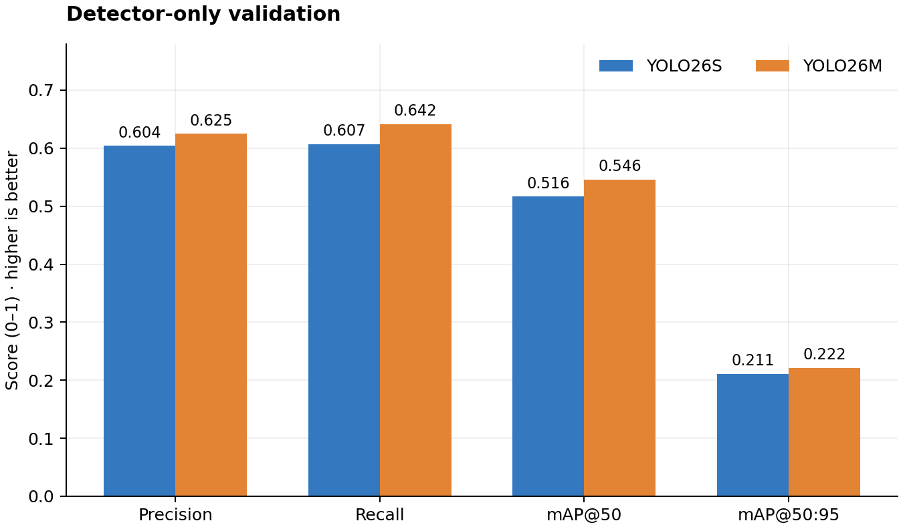

| Detector | Precision ↑ | Recall ↑ | mAP@50 ↑ | mAP@50:95 ↑ |
| --- | ---: | ---: | ---: | ---: |
| YOLO26s | 0.6040 | 0.6072 | 0.5165 | 0.2109 |
| YOLO26m | **0.6246** | **0.6418** | **0.5461** | **0.2216** |

The detection table uses unit-scale values (0–1); the tracking table uses percentages (0–100). Detection was evaluated once per detector, not once per tracker.

**Detector-only GPU profile** (separate run supplied with the BoT-SORT results; not end-to-end tracking):

| Detector | Parameters (M) | GPU inference (ms) | GPU FPS | Precision | Recall | mAP@50 | mAP@50:95 | Peak GPU allocated (GB) |
| --- | ---: | ---: | ---: | ---: | ---: | ---: | ---: | ---: |
| YOLO26s | 10.01 | 37.00 | 27.02 | 0.8492 | 0.3835 | 0.3468 | 0.1532 | 2.20 |
| YOLO26m | 21.90 | 103.71 | 9.64 | 0.8249 | 0.4517 | 0.4038 | 0.1749 | 4.15 |

This profile uses a different evaluation setup from the validation table above (precision and recall differ noticeably), and its timing and memory describe the detector alone, so it should not be compared with the end-to-end tracker columns in the main table.

## Performance comparisons

**Tracking accuracy (HOTA) versus processing speed (FPS)**

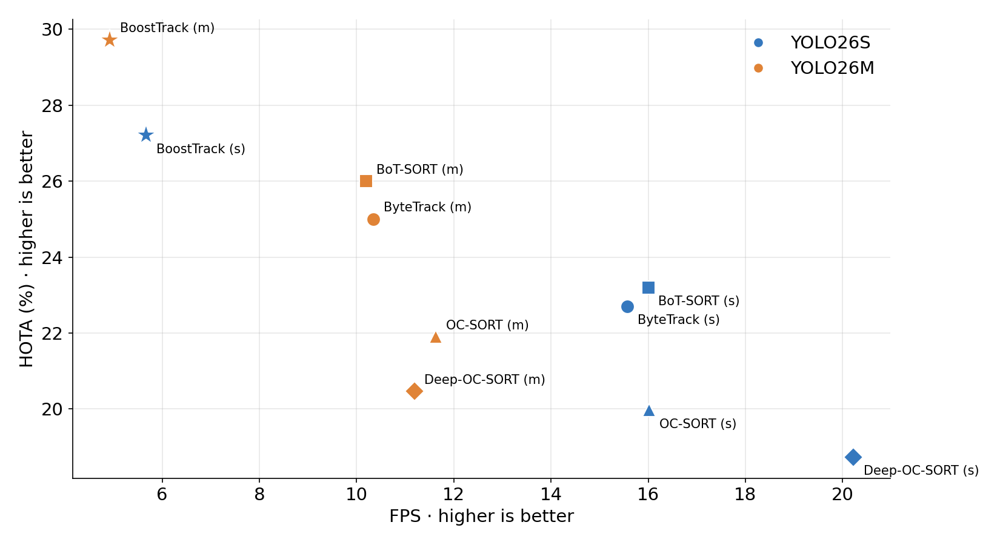

The plot shows each measured detector and tracker combination. BoostTrack has the highest HOTA, while Deep-OC-SORT with YOLO26s has the highest recorded FPS. The [detailed benchmark report](docs/benchmark/tables.md) includes bar charts for FPS, latency, GPU memory, ID switches, and fragmentations, plus per-sequence speed.

**Processing speed (FPS) by tracker**

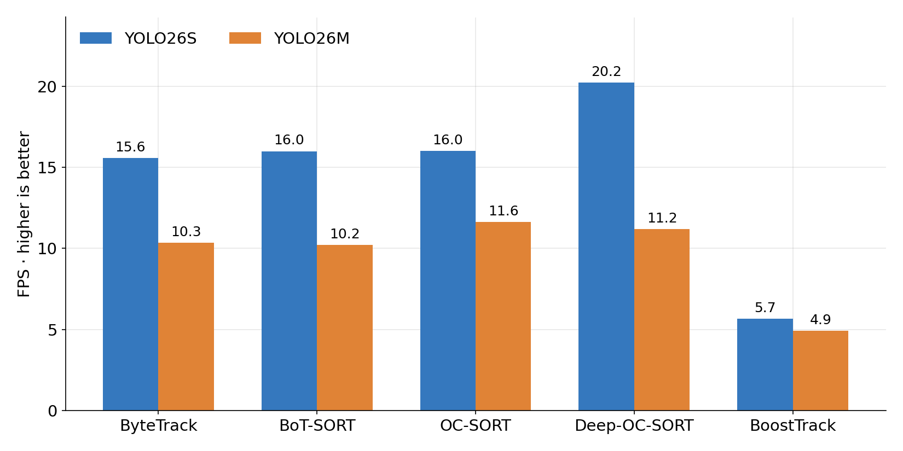

**Mean latency (ms) by tracker**

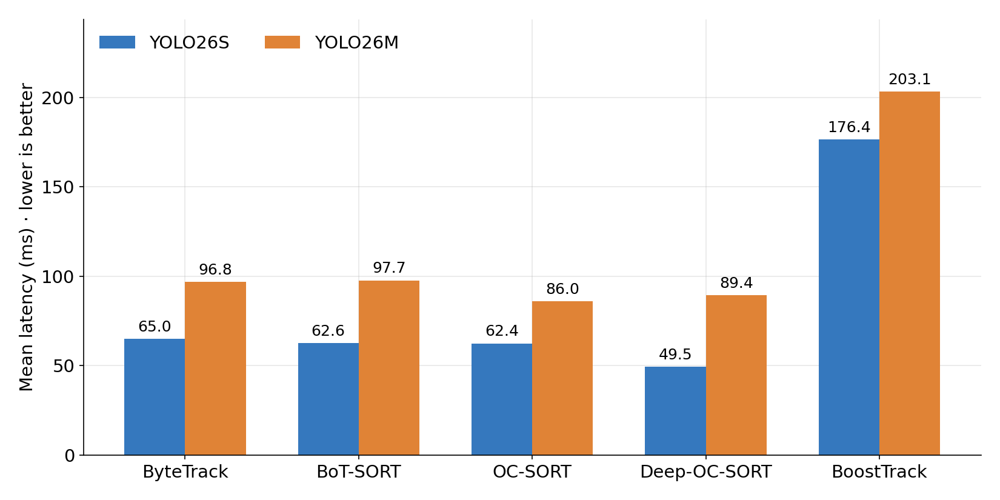

**Peak GPU memory (MB) by tracker**

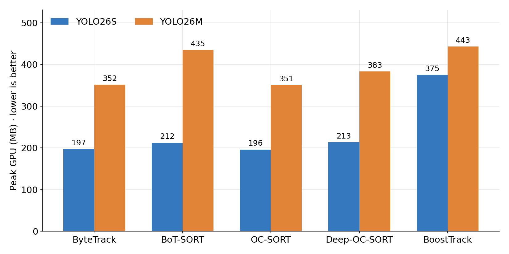

**ID switches by tracker**

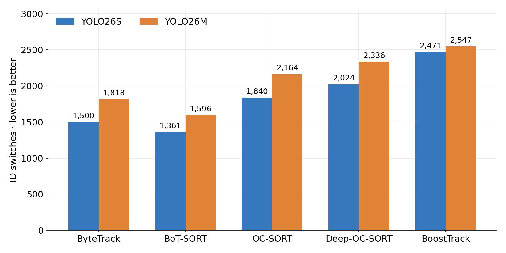

| Tracker | ΔHOTA (pt) | ΔIDF1 (pt) | ΔMOTA (pt) | ΔFPS | ΔLatency (ms) | ΔGPU (MB) | ΔID switches | ΔFragmentations |
| --- | ---: | ---: | ---: | ---: | ---: | ---: | ---: | ---: |
| ByteTrack | +2.30 | +4.80 | +5.00 | -5.22 | +31.77 | +154.94 | +318 | +755 |
| BoT-SORT | +2.80 | +5.30 | +5.20 | -5.80 | +35.10 | +222.80 | +235 | +571 |
| OC-SORT | +1.93 | +4.04 | +3.93 | -4.39 | +23.55 | +154.94 | +324 | +1,403 |
| Deep-OC-SORT | +1.74 | +3.77 | +3.47 | -9.04 | +39.94 | +170.10 | +312 | +2,032 |
| BoostTrack | +2.51 | +4.14 | +4.58 | -0.75 | +26.73 | +67.79 | +76 | +69 |

Each change is **YOLO26m minus YOLO26s** for the same tracker. Positive tracking score changes are improvements; positive latency, GPU, ID switch, and fragmentation changes are increases in cost or error. Timing measurements came from separate runs, as described in [Setup](#setup).

## Interpretation

- **Highest tracking accuracy:** YOLO26m + BoostTrack leads the recorded runs in HOTA (29.72), IDF1 (41.17), and MOTA (32.71), with 4.92 FPS.
- **Best accuracy at practical speed:** YOLO26m + BoT-SORT is second in accuracy (HOTA 26.00, IDF1 34.40, MOTA 26.40) and runs at 10.2 FPS, about twice the speed of YOLO26m + BoostTrack. With YOLO26s, BoT-SORT (HOTA 23.20, 16.0 FPS) edges out ByteTrack (HOTA 22.70, 15.57 FPS).
- **Speed among YOLO26s runs:** Deep-OC-SORT records the highest speed at 20.22 FPS, but with the lowest HOTA (18.73). OC-SORT (16.02 FPS), BoT-SORT (16.00 FPS), and ByteTrack (15.57 FPS) are close to each other, and BoT-SORT has the best HOTA of the three.
- **Identity switches:** BoT-SORT has the lowest count for each detector (1,361 with YOLO26s, 1,596 with YOLO26m), followed by ByteTrack. Switch counts alone do not determine HOTA or IDF1: BoostTrack has the most switches among the compared runs yet the highest HOTA and IDF1.
- **Detector size:** YOLO26m improves HOTA for every evaluated tracker (+1.74 to +2.80 points), at the cost of lower FPS and higher latency and GPU memory in each corresponding run. BoT-SORT gains the most HOTA from the larger detector, and BoostTrack pays the smallest speed cost.
- **Association versus detection:** For BoT-SORT, YOLO26m's gain comes mostly from detection quality (DetA 17.0 → 21.5) rather than association (AssA 32.0 → 31.7).
- **GPU memory:** BoT-SORT uses more GPU memory than ByteTrack and OC-SORT with YOLO26m (435.0 MB versus 351.73 and 350.98 MB), similar to BoostTrack (442.81 MB), but with much higher throughput.

## Repository layout

```text
notebooks/
  bytetrack.ipynb                     # detection, ByteTrack, TrackEval, profiling, visuals
  ocsort_deepocsort_boosttrack.ipynb  # three tracker runs and evaluation
results/
  comparison.csv                      # all measured detector/tracker combinations
  detection_metrics.csv               # detector-only validation
  crowdhuman_detector_comparison.csv  # 18-detector CrowdHuman comparison used for model selection
  mot20_benchmark.csv                  # 18-detector MOT20 detection benchmark
  tracking_metrics.csv                # ByteTrack tracking metrics
  system_metrics.csv                  # ByteTrack timing and memory
  system_per_sequence.csv             # ByteTrack sequence timing
  botsort/
    model_metrics.csv                 # combined BoT-SORT tracking metrics, both detectors
    pedestrian_summary_yolos.csv      # BoT-SORT per-sequence, YOLO26s
    pedestrian_summary_yolom.csv      # BoT-SORT per-sequence, YOLO26m
    mot20_yolo26_comparison.csv       # detector-only GPU profile
  mot20_benchmark.csv                # 18-detector MOT20 detection benchmark
  ocsort/                             # configuration, summaries, sequence detail
  deepocsort/                         # configuration, summaries, sequence detail
  boosttrack/                         # configuration, summaries, sequence detail
docs/benchmark/
  tables.md                           # detailed tables and charts
  figures/                            # generated PNG bar charts
scripts/

  plot_comparison.py                  # regenerate tracking figures
  plot_crowdhuman.py                  # regenerate detector-selection figures

```

The notebooks are committed with cell outputs cleared to keep the repository manageable. Original ground-truth copies, prediction text files, videos, and checkpoint weights are omitted. Download MOT20 from its official source before rerunning.

## Reproduce the experiments

1. Obtain the MOT20 training images and labels from the [MOTChallenge dataset page](https://motchallenge.net/data/MOT20/), accepting its terms. The notebooks expect the Kaggle layout under `/kaggle/input`; adjust the path discovery cells if running elsewhere.
2. Open [the ByteTrack notebook](notebooks/bytetrack.ipynb) in order for detector validation, ByteTrack tracking, timing, and TrackEval. Its setup cells install the needed dependencies and locate the dataset.
3. Open [the other-trackers notebook](notebooks/ocsort_deepocsort_boosttrack.ipynb) for OC-SORT, Deep-OC-SORT, and BoostTrack. Run its sections in order; the notebook contains installation and TrackEval setup cells.
4. Compare outputs with [comparison.csv](results/comparison.csv) and the tracker-specific summary and per-sequence CSVs under `results/`. BoT-SORT's summaries are in `results/botsort/`.

To regenerate the report figures from the committed CSVs, install `matplotlib` and `numpy`, then run `python scripts/plot_comparison.py` for the tracking figures and `python scripts/plot_crowdhuman.py` for the detector-selection figures.

The notebooks were written for Kaggle and contain environment-specific paths such as `/kaggle/working`. They are experiment records, not a single command-line benchmark runner. The BoostTrack OSNet checkpoint is not included, so reproducing that run requires obtaining the same checkpoint. The BoT-SORT run is recorded through its result CSVs; its notebook and configuration were not part of the supplied artifacts.

## Scope and limitations


These are results on the **MOT20 training split**, not MOT20 test leaderboard scores. The detectors use pretrained weights without MOT20 fine-tuning. Scores reflect the recorded single runs and tracker configurations, and some tracker implementations and ReID settings differ. FPS is taken from each run's own summary, so compare speed with that context. BoT-SORT's environment and configuration were not recorded in the supplied artifacts, so its timing is the least documented of the five trackers. The detector-selection comparison was run on CrowdHuman, not MOT20, and its settings were not recorded. `R@1` and `R@5` fields in some raw summaries are blank and are not reported here.

## Acknowledgments

[MOTChallenge / MOT20](https://motchallenge.net/data/MOT20/), [CrowdHuman](https://www.crowdhuman.org/), [Ultralytics](https://github.com/ultralytics/ultralytics), [TrackEval](https://github.com/JonathonLuiten/TrackEval), and [BoxMOT](https://github.com/mikel-brostrom/boxmot).
=======
These are results on the **MOT20 training split**, not MOT20 test leaderboard scores. The detectors use pretrained weights without MOT20 fine-tuning. Scores reflect the recorded single runs and tracker configurations, and some tracker implementations and ReID settings differ. FPS is taken from each run's own summary, so compare speed with that context. BoT-SORT's environment and configuration were not recorded in the supplied artifacts, so its timing is the least documented of the five trackers. `R@1` and `R@5` fields in some raw summaries are blank and are not reported here.

## Acknowledgments

[MOTChallenge / MOT20](https://motchallenge.net/data/MOT20/), [Ultralytics](https://github.com/ultralytics/ultralytics), [TrackEval](https://github.com/JonathonLuiten/TrackEval), and [BoxMOT](https://github.com/mikel-brostrom/boxmot).

