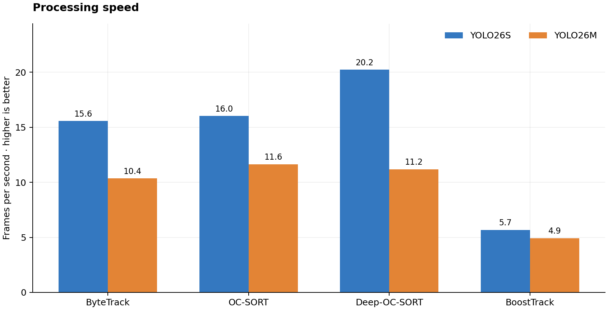
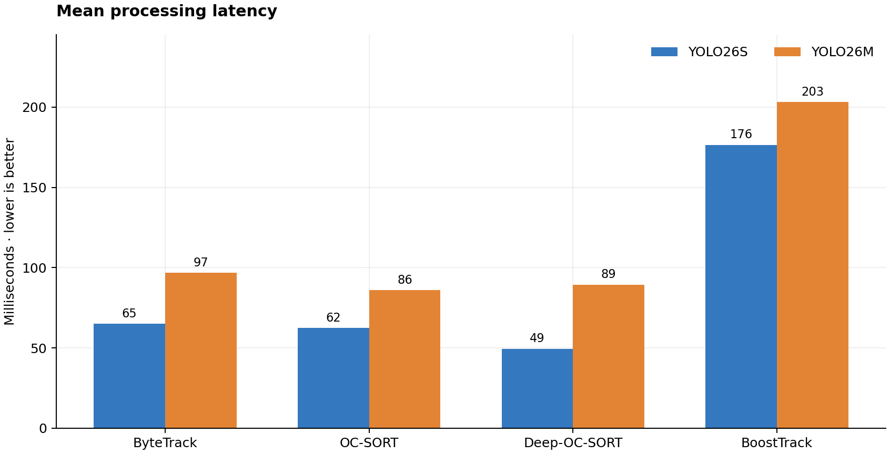
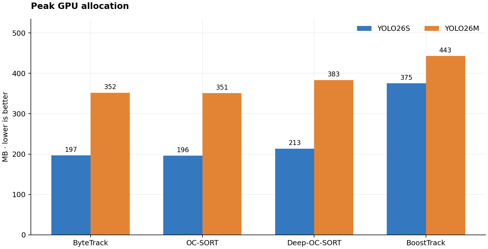
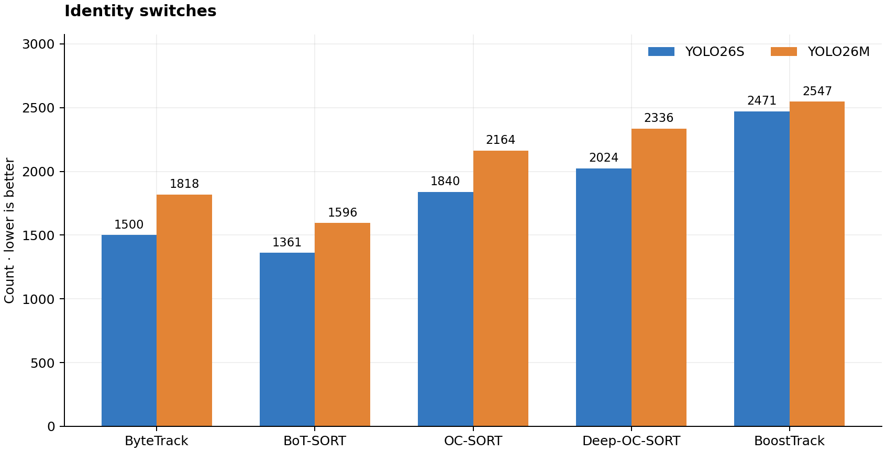
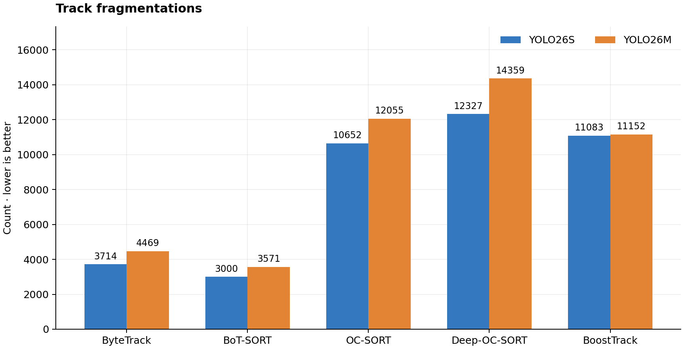
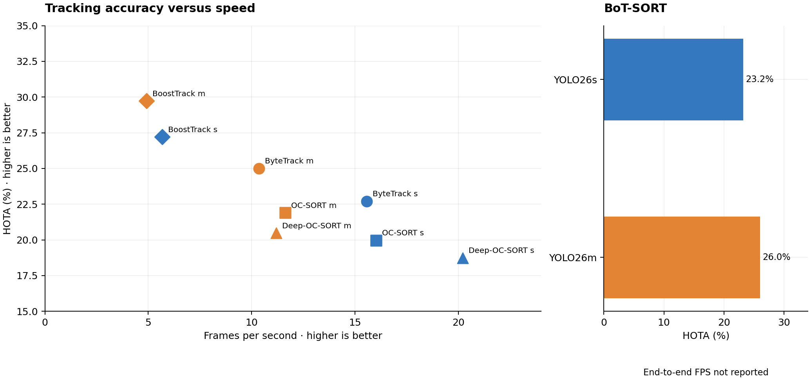

# MOT20 benchmark tables and graphs

All tracking scores are percentages on the MOT20 training sequences. Timings and memory are from each run’s recorded summary. BoT-SORT has tracking scores but no end-to-end timing or memory measurements. See the [main README](../../README.md) for setup and limitations.

## Tracking accuracy

| Detector | Tracker | HOTA ↑ | IDF1 ↑ | MOTA ↑ | ID switches ↓ | Fragmentations ↓ |
| --- | --- | ---: | ---: | ---: | ---: | ---: |
| yolo26s | ByteTrack | 22.70 | 28.00 | 20.90 | 1,500 | 3,714 |
| yolo26m | ByteTrack | 25.00 | 32.80 | 25.90 | 1,818 | 4,469 |
| yolo26s | BoT-SORT | 23.20 | 29.10 | 21.20 | 1,361 | 3,000 |
| yolo26m | BoT-SORT | 26.00 | 34.40 | 26.40 | 1,596 | 3,571 |
| yolo26s | OC-SORT | 19.97 | 23.46 | 16.82 | 1,840 | 10,652 |
| yolo26m | OC-SORT | 21.90 | 27.50 | 20.75 | 2,164 | 12,055 |
| yolo26s | Deep-OC-SORT | 18.73 | 21.36 | 14.76 | 2,024 | 12,327 |
| yolo26m | Deep-OC-SORT | 20.47 | 25.13 | 18.22 | 2,336 | 14,359 |
| yolo26s | BoostTrack | 27.21 | 37.03 | 28.13 | 2,471 | 11,083 |
| yolo26m | BoostTrack | 29.72 | 41.17 | 32.71 | 2,547 | 11,152 |

## Speed and GPU memory

| Detector | Tracker | FPS ↑ | Mean latency (ms) ↓ | Peak GPU allocated (MB) ↓ |
| --- | --- | ---: | ---: | ---: |
| yolo26s | ByteTrack | 15.57 | 64.99 | 196.78 |
| yolo26m | ByteTrack | 10.35 | 96.76 | 351.73 |
| yolo26s | OC-SORT | 16.02 | 62.41 | 196.03 |
| yolo26m | OC-SORT | 11.63 | 85.96 | 350.98 |
| yolo26s | Deep-OC-SORT | 20.22 | 49.45 | 213.34 |
| yolo26m | Deep-OC-SORT | 11.19 | 89.39 | 383.44 |
| yolo26s | BoostTrack | 5.67 | 176.36 | 375.02 |
| yolo26m | BoostTrack | 4.92 | 203.09 | 442.81 |

FPS is the value recorded by each run. BoostTrack labels its column `steady_state_FPS`; the other tracker summaries use `FPS`. GPU memory is allocated memory, not total device usage.

## Identity stability

The counts refer to the full four-sequence evaluation. The tracking accuracy table above gives their exact values. A lower count does not by itself imply a higher HOTA or IDF1 score.

## Accuracy versus speed

Each point in the left panel has measured HOTA and end-to-end FPS. Moving upward improves HOTA; moving right improves FPS. The adjacent BoT-SORT panel shows its measured HOTA without inventing an FPS value. Timing reflects each run's own setup.

## YOLO26m versus YOLO26s

Changes below use YOLO26s as the baseline for the **same tracker**. Positive HOTA and IDF1 changes indicate higher accuracy; negative FPS changes indicate reduced throughput.

| Tracker | ΔHOTA (pt) | ΔIDF1 (pt) | ΔMOTA (pt) | ΔFPS | ΔLatency (ms) | ΔGPU (MB) | ΔID switches | ΔFragmentations |
| --- | ---: | ---: | ---: | ---: | ---: | ---: | ---: | ---: |
| ByteTrack | +2.30 | +4.80 | +5.00 | -5.22 | +31.77 | +154.94 | +318 | +755 |
| BoT-SORT | +2.80 | +5.30 | +5.20 | n/r | n/r | n/r | +235 | +571 |
| OC-SORT | +1.93 | +4.04 | +3.93 | -4.39 | +23.55 | +154.94 | +324 | +1,403 |
| Deep-OC-SORT | +1.74 | +3.77 | +3.47 | -9.04 | +39.94 | +170.10 | +312 | +2,032 |
| BoostTrack | +2.51 | +4.14 | +4.58 | -0.75 | +26.73 | +67.79 | +76 | +69 |

## Detector-only validation

| Detector | Precision ↑ | Recall ↑ | mAP@50 ↑ | mAP@50:95 ↑ |
| --- | ---: | ---: | ---: | ---: |
| yolo26s | 0.6040 | 0.6072 | 0.5165 | 0.2109 |
| yolo26m | 0.6246 | 0.6418 | 0.5461 | 0.2216 |

These scores are on a 0–1 scale and were produced in the ByteTrack notebook’s detector validation stage.

## Per-sequence processing speed

Each of the four sequences was processed with both detectors for each measured tracker. Values below are FPS from the run-specific `system_per_sequence.csv` files.

| Tracker | Detector | MOT20-01 | MOT20-02 | MOT20-03 | MOT20-05 |
| --- | --- | ---: | ---: | ---: | ---: |
| ByteTrack | yolo26s | 13.75 | 14.62 | 18.37 | 15.53 |
| ByteTrack | yolo26m | 10.93 | 10.52 | 9.89 | 10.06 |
| OC-SORT | yolo26s | 16.13 | 16.15 | 15.52 | 16.29 |
| OC-SORT | yolo26m | 12.88 | 12.95 | 10.52 | 11.39 |
| Deep-OC-SORT | yolo26s | 20.26 | 20.26 | 19.35 | 20.87 |
| Deep-OC-SORT | yolo26m | 12.52 | 12.54 | 9.91 | 11.06 |
| BoostTrack | yolo26s | 5.77 | 6.55 | 5.14 | 5.45 |
| BoostTrack | yolo26m | 5.35 | 5.79 | 4.66 | 4.50 |

Raw per-sequence TrackEval CSVs for OC-SORT, Deep-OC-SORT, and BoostTrack are linked below. ByteTrack’s supplied files contain per-sequence system metrics but only aggregate tracking scores.

## Raw results

- [Combined comparison](../../results/comparison.csv) · [ByteTrack tracking](../../results/tracking_metrics.csv) · [ByteTrack system](../../results/system_metrics.csv)
- [BoT-SORT tracking](../../results/botsorttrack/model_metrics.csv) · [BoT-SORT per-sequence results](../../results/botsorttrack/per_sequence/)
- [OC-SORT summaries](../../results/ocsort/) · [Deep-OC-SORT summaries](../../results/deepocsort/) · [BoostTrack summaries](../../results/boosttrack/)

Regenerate charts with `python scripts/plot_comparison.py` from the repository root.
